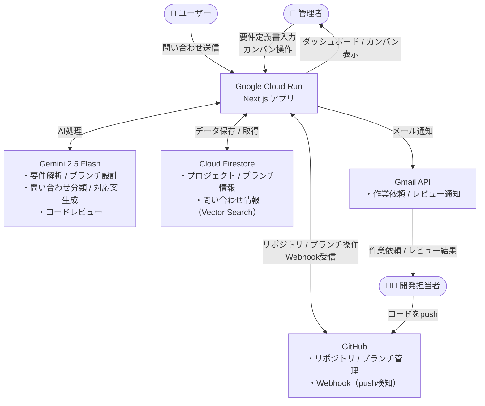

# FlowForge

> 要件定義からコードレビュー、お問い合わせ対応まで、AIが伴走する

要件定義書の読み込みから、GitHubリポジトリ・ブランチの自動作成、AIコードレビュー、問い合わせ管理までを一貫してサポートする開発プロジェクト管理AIエージェント。

---

## 主な機能

- **要件解析** — 要件定義書を入力するだけで新規/改造を自動判定し、類似リポジトリを提示
- **機能要件抽出** — GeminiがAIで機能要件の叩き台を自動生成。担当者が編集して確定
- **ブランチ設計** — 確定した機能要件をもとにブランチ構成を自動提案
- **GitHub自動連携** — リポジトリ・ブランチの自動作成、Webhookの自動登録
- **コードレビュー自動実行** — pushのたびに機能要件を参照したAIレビューを実施し、担当者へメール通知
- **問い合わせ管理** — 問い合わせを自動分類・一時対応案を生成し、カンバンボードで管理
- **進捗ダッシュボード** — ブランチの完了状況・レビュー結果を一覧表示

---

## 技術スタック

| カテゴリ                      | 技術                                         |
| ----------------------------- | -------------------------------------------- |
| フロントエンド / バックエンド | Next.js 16 (TypeScript) / Tailwind CSS       |
| ホスティング                  | Google Cloud Run                             |
| データベース                  | Google Cloud Firestore（Vector Search 含む） |
| AI                            | Gemini 2.5 Flash API / Gemini Embedding API  |
| リポジトリ管理                | GitHub API (Octokit) / GitHub Webhook        |
| 通知                          | Gmail API                                    |

---

## システム構成



---

## セットアップ

### 前提条件

- Node.js 20 以上
- Google Cloud プロジェクト（Firestore・Cloud Run 有効化済み）
- GitHub Personal Access Token
- Google AI Studio API キー（Gemini）
- Gmail API 認証情報

### 手順

```bash
# リポジトリをクローン
git clone https://github.com/spring1293/devprojectmanager.git
cd flowforge

# 依存パッケージをインストール
npm install

# 環境変数を設定
cp .env.example .env.local
# .env.local を編集して各APIキーを入力

# 開発サーバーを起動
npm run dev
```

---

## 環境変数

`.env.local` に以下の変数を設定してください。

| 変数名                         | 説明                                                            |
| ------------------------------ | --------------------------------------------------------------- |
| `GEMINI_API_KEY`               | Google AI Studio で発行した Gemini API キー                     |
| `GITHUB_TOKEN`                 | リポジトリ・ブランチ作成権限を持つ GitHub Personal Access Token |
| `GITHUB_WEBHOOK_SECRET`        | Webhook 署名検証用の任意の秘密文字列                            |
| `FIREBASE_PROJECT_ID`          | Firebase プロジェクト ID                                        |
| `FIREBASE_CLIENT_EMAIL`        | Firebase サービスアカウントのメールアドレス                     |
| `FIREBASE_SERVICE_ACCOUNT_KEY` | Firebase サービスアカウントキー（JSON を文字列化したもの）      |
| `GMAIL_CLIENT_ID`              | Gmail API の OAuth 2.0 クライアント ID                          |
| `GMAIL_CLIENT_SECRET`          | Gmail API の OAuth 2.0 クライアントシークレット                 |
| `GMAIL_REFRESH_TOKEN`          | Gmail API のリフレッシュトークン                                |
| `APP_URL`                      | デプロイ先のアプリケーション URL（Webhook 登録に使用）          |

---

## 使い方

1. **新規プロジェクト追加** — ダッシュボードの「新規プロジェクト追加」から要件定義書を入力
2. **機能要件を確認・編集** — AIが生成した機能要件の叩き台を確認・修正して確定
3. **ブランチ設計を承認** — AIが提案したブランチ構成を確認し、担当者を入力して確定
4. **開発開始** — GitHub にリポジトリ・ブランチが自動作成され、担当者にメールが届く
5. **コードレビュー自動実行** — 担当ブランチに push するたびに AI レビューが実施される
6. **問い合わせ対応** — 「お問い合わせフォーム」から受け付けた問い合わせをカンバンで管理

---

## ライセンス

[MIT](LICENSE)
